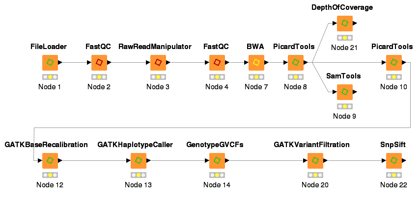
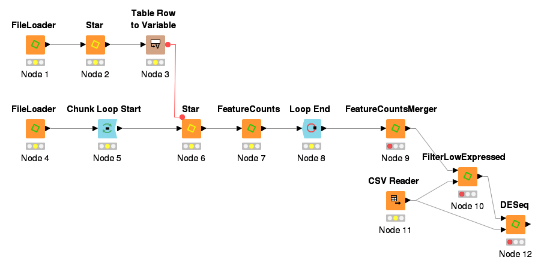

# KNIME4NGS Test Workflows

Two test workflows show how to connect the nodes of the KNIME4NGS toolkit to create powerful analysis pipelines for variant calling (DNA-seq) and differential expression analysis (RNA-seq).
Small sample datasets are provided for both workflows which allow you to execute all nodes locally within a short period of time.

The following descriptions of the workflows assume that you have downloaded KNIME and installed the KNIME4NGS extension as described in the [manual](https://github.com/ibisngs/knime4ngs/raw/gh-pages/knime4ngs_manual.pdf).
Further, you have to download the provided [resource bundle](https://github.com/ibisngs/knime4ngs/archive/resource.zip) and extract and unzip all included files.
We recommend to feed the KNIME4NGS preference page with the resource bundle [reference genome](https://github.com/ibisngs/knime4ngs/tree/resource/RefGenome) and [variant sets](https://github.com/ibisngs/knime4ngs/tree/resource/VariantSets) before importing the test workflows as it minimizes repetitive node configuration.
Then, the provided workflows can easily be imported into KNIME via *Import KNIME Workflow...* in the *File* menu.

## Variant Calling

The [variant calling workflow](https://github.com/ibisngs/knime4ngs/raw/master/KNIME4NGS_Test_VarCalling.zip) covers all steps from raw read quality assessment to variant annotation.

Before executing the workflow, you have to open the node dialog of the **FileLoader** and select NA12877\_R1.fastq and NA12877\_R2.fastq in the folder [VarCalling](https://github.com/ibisngs/knime4ngs/tree/resource/VarCalling) of the resource bundle as the first and second fastQ input file.
Then, the status lights of all nodes should change to yellow which indicates that you can execute the complete workflow now.

## Differential Expression

The [differential expression workflow](https://github.com/ibisngs/knime4ngs/raw/master/KNIME4NGS_Test_DiffExpression.zip) initially creates a genome index used for read alignment.
Then, it iterates over RNA-seq data of 8 individuals, merges the read counts and uses the **DESeq** node to perform differential expression analysis.

The upper **FileLoader** of the workflow has to be loaded with the fastA file of the [reference genome](https://github.com/ibisngs/knime4ngs/tree/resource/RefGenome).
The lower FileLoader takes a [list of the fastQ files](https://github.com/ibisngs/knime4ngs/raw/resource/DiffExpression/diff_exp_fastq.list) as input.
Then, set the path to the annotation file in the dialog of the **FeatureCounts** node which corresponds to the path to the file [Homo_sapiens.GRCh37.75.chr16.gtf](https://github.com/ibisngs/knime4ngs/blob/resource/DiffExpression/Homo_sapiens.GRCh37.75.chr16.gtf.gz) in your resources folder.
Finally, you have to select the [sample_cond.tsv](https://github.com/ibisngs/knime4ngs/raw/resource/DiffExpression/sample_cond.tsv) using the **CSVReader** node.
Although, the status lights of some nodes are still red you can now execute the workflow.

